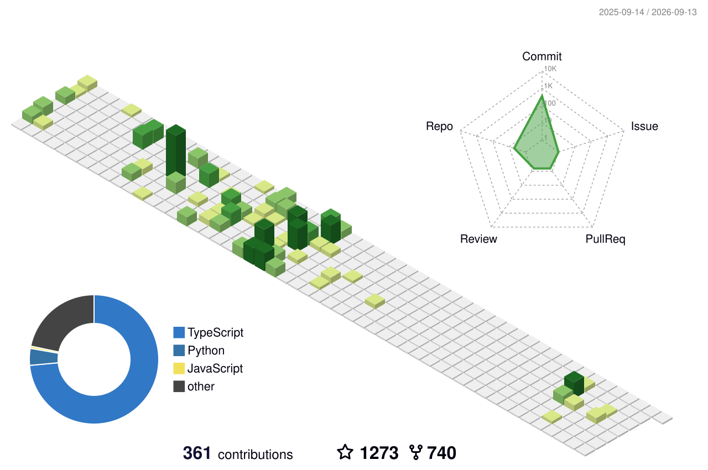

  <picture>
    <source media="(prefers-color-scheme: dark)" srcset="./assets/profile-hero-dark.svg">
    <source media="(prefers-color-scheme: light)" srcset="./assets/profile-hero-light.svg">
    
  </picture>

  
  
  

## `> whoami`

I'm **Ouonnki**, a Frontend / Full Stack Developer based in Shanghai, China.

I enjoy turning ideas into polished web experiences, building useful open-source tools, and exploring the intersection of **AI, agents, and human-computer interaction**. This is where I ship experiments, document what I learn, and share the occasional thing that becomes unexpectedly popular.

- 🔭 Building **web products, developer tools, and AI-assisted workflows**
- 🧭 Exploring **AI Agents, multimodal AI, and high-fidelity UI engineering**
- ✍️ Writing about technology and life at **[Ouonnki Space](https://ouonnki.com/)**
- ⚡ Motto: **Life is fantastic!**

## `> featured_projects`

| Project | What it does | Signal |
| :--- | :--- | :---: |
| **[OuonnkiTV](https://github.com/Ouonnki/OuonnkiTV)** | A modern video aggregation, search, and playback frontend with one-click deployment. |  |
| **[PicOK Image Hosting](https://github.com/Ouonnki/PicOK-Image-Hosting)** | A Vercel-based image hosting solution designed for simple GitHub deployment. | `TypeScript` |
| **[Figma to React Workflow](https://github.com/Ouonnki/figma-to-react-workflow)** | A high-fidelity Figma-to-React workflow with render capture and pixel-diff QA. | `UI × AI` |
| **[Satellite Authentication](https://github.com/Ouonnki/satellite_authentication)** | Research reproduction for secure satellite-network authentication. | `Python` |

  <a href="https://github.com/Ouonnki?tab=repositories"><b>Explore all repositories →</b></a>

## `> toolbox`

  

  <code>Designing interfaces</code> · <code>Shipping products</code> · <code>Automating workflows</code> · <code>Learning in public</code>

## `> research_notes`

  
<b>Selected publications on edge computing, task offloading, and reinforcement learning</b>

   

- **Privacy-Preserving Task Offloading in Vehicular Edge Computing Using Federated Multi-Agent Reinforcement Learning** 
  *IEEE Transactions on Vehicular Technology*, 2025 · [DOI](https://doi.org/10.1109/TVT.2025.3588204)
- **Enhancing Task Offloading in Vehicular Networks: A Multi-Agent Cloud-Edge-Device Framework** 
  *Vehicular Communications*, 2025 · [DOI](https://doi.org/10.1016/j.vehcom.2025.100898)
- **Energy-Efficient Virtual Network Embedding: A Deep Reinforcement Learning Approach Based on Graph Convolutional Networks** 
  *Electronics*, 2024 · [DOI](https://doi.org/10.3390/electronics13101918)

## `> activity_stream`

  <picture>
    <source media="(prefers-color-scheme: dark)" srcset="./profile-3d-contrib/profile-night-green.svg">
    <source media="(prefers-color-scheme: light)" srcset="./profile-3d-contrib/profile-green-animate.svg">
    
  </picture>

  <picture>
    <source media="(prefers-color-scheme: dark)" srcset="https://raw.githubusercontent.com/Ouonnki/Ouonnki/output/github-snake-dark.svg">
    <source media="(prefers-color-scheme: light)" srcset="https://raw.githubusercontent.com/Ouonnki/Ouonnki/output/github-snake.svg">
    
  </picture>

 

  Made with curiosity, caffeine, and a fondness for clean interfaces. 
  <b>Thanks for stopping by — have a fantastic day.</b>

